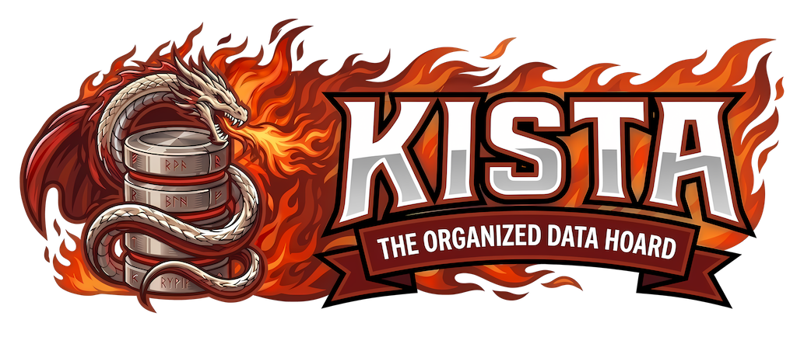

[](https://codecov.io/gh/deveel/kista)
[](https://deveel.gitbook.io/kista/)

<p align="center">
  
</p>

# Kista

> **Renamed:** This project was renamed from **Deveel.Repository** to **Kista** on **May 26, 2025**. The name *Kista* is Old Norse for "chest" or "repository", better reflecting the project's purpose as a data access framework.

**Kista** is a lightweight .NET framework that provides a principled implementation of the [_Repository Pattern_](https://martinfowler.com/eaaCatalog/repository.html), designed to help developers build applications grounded in [_Domain-Driven Design (DDD)_](https://en.wikipedia.org/wiki/Domain-driven_design) and [_SOLID_](https://en.wikipedia.org/wiki/SOLID) principles.

The framework abstracts data access behind a clean, stable interface — keeping your domain model independent of any specific persistence technology — while integrating seamlessly with popular data-access libraries as the underlying backing store.

---

## Why Kista?

At its core, **Kista** is about _keeping your domain clean_.

In Domain-Driven Design the repository is not merely a data-access helper: it is the **boundary between the domain model and the infrastructure layer**. It speaks the language of the domain (entities, aggregates, identities) while hiding every detail of how data is fetched or persisted.

This library was born from the need to have a consistent, framework-agnostic abstraction for this boundary, without forcing application developers to:

- couple their domain logic to a specific ORM or database driver, or
- re-implement the same boilerplate repository scaffolding in every project.

> **It was never the intention to build another ORM.** Object-Relational Mappers (and document-mapper equivalents) such as Entity Framework Core, Dapper, or MongoFramework are excellent tools for mapping objects to storage. Kista _uses_ them — it does not replace them.

### Kista vs. ORMs

The table below highlights the key differences and shows how both layers coexist:

| Concern | ORM (EF Core, Dapper, …) | Kista |
|---|---|---|
| **Responsibility** | Map objects ↔ database tables / documents | Provide a domain-oriented access interface |
| **Speaks the language of** | Database schema, SQL, drivers | Domain model (entities, aggregates) |
| **Knows about** | Tables, columns, change tracking, transactions | Collections of entities and their identities |
| **Lives in layer** | Infrastructure | Domain / Application boundary |
| **Used by** | Repositories and infrastructure code | Application services and domain services |

In practice, **you create a repository _on top of_ an ORM** — the ORM handles low-level persistence while Kista defines _what_ the application can ask for. For example, `Kista.EntityFramework` wraps Entity Framework Core's `DbContext` behind the `IRepository<TEntity>` interface, giving the domain a stable contract that survives database migrations and EF Core upgrades. The same principle applies to `Kista.MongoFramework` (backed by MongoFramework / MongoDB) and any custom driver you care to write.

This is not a limitation — it is by design. Decoupling ORMs from domain logic is one of the most impactful architectural decisions you can make for long-term maintainability.

---

## Libraries

The framework is organized into a _kernel_ package (providing interfaces and abstractions) and a set of _driver_ packages that wire those abstractions to concrete data sources.

- **Stable releases** are published to [**NuGet.org**](https://www.nuget.org/profiles/deveel).
- **Pre-release / unstable builds** are available from the [**GitHub Packages**](https://github.com/deveel/kista/packages) feed (`https://nuget.pkg.github.com/kista/index.json`).

| Package                                | Description                                                                                                   | NuGet (stable) | Pre-Release (GitHub) |
|----------------------------------------|---------------------------------------------------------------------------------------------------------------| :------------: | :------------------: |
| `Kista`               | Kernel abstractions: interfaces, base types, and DI extensions                                                | [](https://www.nuget.org/packages/Kista/) | [](https://github.com/deveel/kista/packages/nuget/Kista) |
| `Kista.InMemory`           | Volatile, in-process repository — ideal for testing and prototyping                                           | [](https://www.nuget.org/packages/Kista.InMemory/) | [](https://github.com/deveel/kista/packages/nuget/Kista.InMemory) |
| `Kista.EntityFramework`    | Repository driver backed by [Entity Framework Core](https://github.com/dotnet/efcore)                         | [](https://www.nuget.org/packages/Kista.EntityFramework/) | [](https://github.com/deveel/kista/packages/nuget/Kista.EntityFramework) |
| `Kista.MongoFramework`     | Repository driver backed by [MongoFramework](https://github.com/turnersoftware/mongoframework) / MongoDB      | [](https://www.nuget.org/packages/Kista.MongoFramework/) | [](https://github.com/deveel/kista/packages/nuget/Kista.MongoFramework) |
| `Kista.MongoFramework.MultiTenant` | Multi-tenant MongoDB connection management via [Finbuckle.MultiTenant](https://github.com/Finbuckle/Finbuckle.MultiTenant) | [](https://www.nuget.org/packages/Kista.MongoFramework.MultiTenant/) | [](https://github.com/deveel/kista/packages/nuget/Kista.MongoFramework.MultiTenant) |
| `Kista.DynamicLinq`        | Filter / query support via [System.Linq.Dynamic.Core](https://github.com/zzzprojects/System.Linq.Dynamic.Core) | [](https://www.nuget.org/packages/Kista.DynamicLinq/) | [](https://github.com/deveel/kista/packages/nuget/Kista.DynamicLinq) |
| `Kista.Manager`            | Business layer (_EntityManager_) with validation, normalization, event sourcing, and logging                  | [](https://www.nuget.org/packages/Kista.Manager/) | [](https://github.com/deveel/kista/packages/nuget/Kista.Manager) |
| `Kista.Manager.DynamicLinq` | Dynamic LINQ query extensions for the Entity Manager                                                          | [](https://www.nuget.org/packages/Kista.Manager.DynamicLinq/) | [](https://github.com/deveel/kista/packages/nuget/Kista.Manager.DynamicLinq) |
| `Kista.Manager.EasyCaching` | Second-level caching for the Entity Manager via [EasyCaching](https://github.com/dotnetcore/EasyCaching)      | [](https://www.nuget.org/packages/Kista.Manager.EasyCaching/) | [](https://github.com/deveel/kista/packages/nuget/Kista.Manager.EasyCaching) |
| `Kista.Manager.AspNetCore` | ASP.NET Core integration for automatic HTTP request cancellation                                              | [](https://www.nuget.org/packages/Kista.Manager.AspNetCore/) | [](https://github.com/deveel/kista/packages/nuget/Kista.Manager.AspNetCore) |
| `Kista.Owners`             | Decorator-based user scoping with automatic owner assignment and query filtering                                   | [](https://www.nuget.org/packages/Kista.Owners/) | [](https://github.com/deveel/kista/packages/nuget/Kista.Owners) |
| `Kista.States.Core`        | Entity state management abstractions (experimental)                                                           | [](https://www.nuget.org/packages/Kista.States.Core/) | [](https://github.com/deveel/kista/packages/nuget/Kista.States.Core) |

---

## Quick Start

### 1. Install a driver package

Pick the driver that matches your data source. The `Core` kernel package is pulled in automatically as a transitive dependency:

```bash
# Entity Framework Core
dotnet add package Kista.EntityFramework

# MongoDB
dotnet add package Kista.MongoFramework

# In-Memory (testing / prototyping)
dotnet add package Kista.InMemory
```

To consume an unstable pre-release build, add the GitHub Packages feed first:

```bash
dotnet nuget add source https://nuget.pkg.github.com/kista/index.json \
  --name kista-github --username <your-github-username> --password <your-pat>
```

### 2. Register the repository

Use the `AddRepositoryContext()` builder to configure your driver:

```csharp
// Program.cs
builder.Services.AddRepositoryContext()
    .UseInMemory();
```

For Entity Framework Core or MongoDB, replace `.UseInMemory()` with the appropriate driver:

```csharp
// Entity Framework Core
builder.Services.AddRepositoryContext()
    .UseEntityFramework<MyDbContext>();

// MongoDB
builder.Services.AddRepositoryContext()
    .UseMongoDB<MyMongoContext>();
```

After registration the following services are resolvable from the DI container (availability depends on the concrete repository's capabilities):

| Interface | Description |
|---|---|
| `IRepository<TEntity>` | Core CRUD, single-entity look-up (`FindAsync`), and unsorted pagination (`GetPageAsync`) |
| `ITrackingRepository<TEntity>` | Change tracking and original value look-ups |

> **Note:** The legacy interfaces `IQueryableRepository`, `IPageableRepository`, and `IFilterableRepository` are deprecated. Query capabilities are now provided through `protected` members of `Repository<TEntity, TKey>`. For domain-specific queries, extend the base repository with custom methods. See the [full documentation](docs/index.md) for details.

### 3. Consume the repository in your services

```csharp
public class OrderService(IRepository<Order> orders)
{
    public Task<Order?> GetAsync(string id, CancellationToken ct)
        => orders.FindAsync(id, ct);

    public Task PlaceAsync(Order order, CancellationToken ct)
        => orders.AddAsync(order, ct);
}
```

For driver-specific configuration, multi-tenancy, and guidance on writing a custom repository, refer to the [full documentation](docs/index.md) or browse it online at [GitBook](https://deveel.gitbook.io/kista/).

---

## Documentation and Guides

| Topic | Description |
|---|---|
| [Getting Started](docs/index.md) | Installation, requirements, and first steps |
| [Entity Framework Core driver](docs/repository-implementations/ef-core.md) | Storing entities via EF Core |
| [MongoDB driver](docs/repository-implementations/mongodb.md) | Storing entities in MongoDB |
| [In-Memory driver](docs/repository-implementations/in-memory.md) | In-process volatile storage |
| [Entity Manager](docs/entity-manager/) | Business layer with validation, caching, and events |
| [Custom repositories](docs/custom-repository/) | Write your own driver |
| [Multi-Tenancy](docs/multi-tenancy.md) | Tenant-isolated repositories |
| [User Entities](docs/user-entities.md) | User-scoped entities with owner filtering |

Full documentation is also available on [GitBook](https://deveel.gitbook.io/kista/).

---

## Roadmap

We are actively building Kista toward a comprehensive, production-ready framework. See the [complete roadmap](ROADMAP.md) for detailed feature descriptions, timelines, and architectural decisions.

### Release Timeline

- [x] **v1.5.0** — "Solid Ground"
  - [x] Package Namespace Correction
  - [x] Thread-Safe In-Memory Repository
  - [x] Expression Compilation Cache
  - [x] Full .NET 10 Compatibility and Benchmark Baseline
  - [x] XML Documentation Completeness
  - [x] Conversion to ValueTask Results for Asynchronous Methods
  - [x] General Performance Optimizations

- [ ] **v1.6.0** — "Developer Flow"
  - [x] Unified Repository Setup Builder
  - [ ] QueryBuilder Execution Extensions
  - [ ] Pluggable Cache Provider Abstraction
  - [ ] Automatic Timestamp and Ownership Management
  - [ ] Repository Health Checks
  - [ ] Repository Controller Lifecycle Redesign

- [ ] **v1.7.0** — "Entity Lifecycle"
  - [ ] Soft Delete Support
  - [ ] Entity State Machine
  - [ ] Domain Event Emission from EntityManager

- [ ] **v1.8.0** — "Scale & Throughput"
  - [ ] Batch Operations in EntityManager
  - [ ] Async Streaming Queries
  - [ ] Read/Write Repository Split

- [ ] **v1.9.0** — "Observability & Governance"
  - [ ] OpenTelemetry Integration
  - [ ] Audit Trail Support
  - [ ] EF Core Multi-Tenancy Parity

- [ ] **v2.0.0** — "Platform Modernization"
  - [ ] Minimum .NET 9 Baseline
  - [ ] Simplified Repository Interface Hierarchy
  - [ ] Remove Obsolete Capability Interfaces
  - [ ] Repository Source Generators

- [ ] **v2.1.0** — "New Database Drivers"
  - [ ] PostgreSQL Native Driver
  - [ ] Azure Cosmos DB Driver
  - [ ] Dapper Repository Driver
  - [ ] Service-Based Repository Driver
  - [ ] Neo4j Repository Driver

For more details on features, design rationale, and success criteria, see the [ROADMAP](ROADMAP.md).

---

## License

The project is licensed under the terms of the [Apache Public License v2](LICENSE), which allows unrestricted use in any project — open-source or commercial — without restriction.

## Contributing

The project is open to contributions. Please read the [contributing guidelines](CONTRIBUTING.md) before opening a pull request.

## Contributors

A huge thank-you to everyone who has contributed code, documentation, bug reports, and ideas:

[](https://github.com/deveel/kista/graphs/contributors)

_Contributions of all kinds are welcome — see [CONTRIBUTING.md](CONTRIBUTING.md) to get started._
